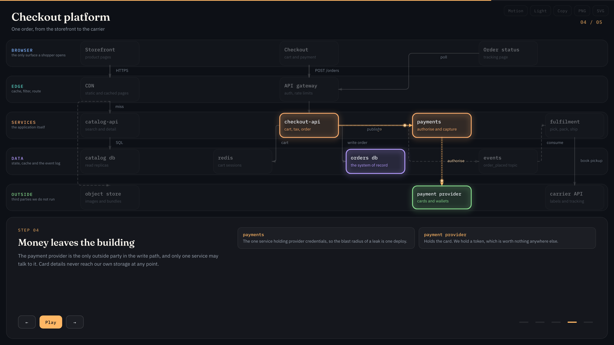
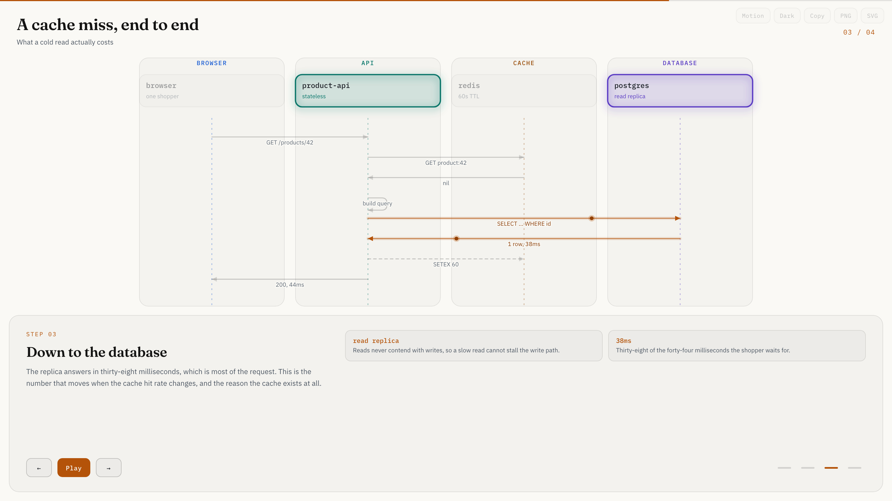

<h1 align="center">Strata</h1>

<p align="center">
  Narrated architecture diagrams as one self-contained HTML file.<br>
  You write typed JSON. The tool computes the layout, renders it, and refuses to call it done until four gates pass.
</p>

<p align="center">
  <a href="#install"><strong>Install</strong></a> ·
  <a href="#quick-start"><strong>Quick start</strong></a> ·
  <a href="#the-five-types"><strong>Types</strong></a> ·
  <a href="#the-gates"><strong>Gates</strong></a> ·
  <a href="#citing-real-code"><strong>Citations</strong></a>
</p>

<p align="center">
  
</p>

---

## What it is

An [agent skill](https://docs.claude.com/en/docs/agents-and-tools/agent-skills) for producing
diagrams that are worth putting in front of people. Describe a system to your agent; it writes
a typed JSON document and runs one command. Out comes a single HTML file you can present,
email, or drop in a repo.

Three ideas do most of the work.

**The agent never places coordinates.** It writes meaning — *this is a service, it sits in the
API tier, it comes fourth* — and the layout engine turns that into geometry. Models are poor at
arithmetic about two-dimensional space and good at knowing what a thing is. It also means that
when a check fails, the fix is in the same language you wrote in: *give it a different column*,
not *nudge it forty pixels right*.

**Layers and a narrated walkthrough are first class.** A diagram is not only boxes and arrows.
It is a sequence of beats, each lighting the parts involved and saying what they are for. That
turns a picture you point at into something you can talk over.

**Nothing is called finished until it is checked.** Overlapping boxes, clipped labels, a
connector drawn through a component it does not touch, a citation that contains no code, a
script error in Safari — all of them fail the build rather than reaching a reader.

<p align="center">
  
</p>

## Install

Clone it where your agent looks for skills — for your user:

```bash
git clone https://github.com/AhmedNazihX/Strata.git ~/.claude/skills/strata
```

or scoped to one project, so it travels with the repo:

```bash
git clone https://github.com/AhmedNazihX/Strata.git .claude/skills/strata
```

Either works; the CLI resolves itself relative to the skill directory. Optionally put the
command on your `PATH`:

```bash
ln -s "$PWD/bin/strata.mjs" ~/.local/bin/strata
```

Node 18 or newer. **No dependencies.** The browser gate uses Playwright if it can find it —
in your project, or beside the skill — and reports itself as skipped if it cannot:

```bash
npm i -D playwright && npx playwright install chromium webkit
```

Check what your install can do:

```bash
strata doctor
```

## Quick start

Write five of everything and render them:

```bash
strata demo ./strata-demo
```

Then open a `.json` to see the shape and the `.html` beside it to see what that shape produces.

For real work, the agent writes `candidate.json` and runs:

```bash
strata finalize candidate.json
```

For a diagram that describes actual code, add the checkout so citations are verified and the
cited lines are embedded:

```bash
strata finalize candidate.json --repo-root .
```

## The five types

One document shape, five dialects. What changes is the vocabulary and what the layers mean.

| Type | The reader learns | Layers are |
|---|---|---|
| `architecture` | which tier a component lives in, and what talks to what | tiers, as horizontal rails |
| `workflow` | what happens in what order, and where it branches | optional swimlanes |
| `sequence` | who calls whom, in what order, down a time axis | participants, as columns |
| `dataflow` | where data comes from, what changes it, who consumes it | pipeline stages, as columns |
| `lifecycle` | what states a thing can be in, and what moves it | optional groups |

A minimal document:

```jsonc
{
  "schema_version": 1,
  "diagram_type": "architecture",
  "meta": { "title": "Checkout platform", "output": "checkout.html" },
  "layers": [
    { "id": "web", "name": "BROWSER", "note": "the only surface a shopper opens" },
    { "id": "svc", "name": "SERVICES", "note": "the application itself" }
  ],
  "nodes": [
    { "id": "pay",      "layer": "web", "col": 0, "label": "Checkout",     "sublabel": "cart and payment" },
    { "id": "checkout", "layer": "svc", "col": 0, "label": "checkout-api", "sublabel": "cart, tax, order" }
  ],
  "links": [{ "id": "l1", "from": "pay", "to": "checkout", "label": "POST /orders" }],
  "steps": [{
    "title": "Checkout crosses the edge",
    "lede": "Paying is the first request that must be authenticated, so it goes through the gateway rather than the CDN.",
    "nodes": ["pay", "checkout"],
    "links": ["l1"],
    "notes": [{ "k": "checkout-api", "v": "Holds no state of its own, so any instance can answer any request." }]
  }]
}
```

Mermaid works as input too — read it for topology, then author fresh. `flowchart` becomes a
workflow, `sequenceDiagram` a sequence, `stateDiagram` a lifecycle.

## What the reader gets

One HTML file. No build step, no server, no account.

- **Dark and light themes** on a button or `T`
- **Arrow keys, space, `1`–`9`** and the step bars drive the walkthrough; it also autoplays
- **Clickable nodes** open their detail and their cited source
- **Copy to clipboard, PNG at 2×, vector SVG** from the toolbar
- **Deep links** — `#step=4`, `#theme=light`, `#motion=on`, `#node=<id>`

Animation follows the system's reduced-motion setting, so the same file can animate in one
browser and sit still in another on the same machine. `M` overrides it for that document.

Pause stops the walkthrough advancing; it does not freeze the diagram, because a presenter who
pauses to talk about a step still wants that step's flow moving.

## The gates

`finalize` runs four in order and stops at the first failure. A non-zero exit is never success.

| Gate | What it proves |
|---|---|
| **schema** | shape, limits, every reference resolves; with `--repo-root`, every cited file and line exists and holds actual code |
| **geometry** | on the computed layout: no overlapping boxes, nothing outside the canvas, no connector through a node it does not touch, no clipped label, no caption that does not fit |
| **render** | one self-contained HTML written |
| **browser** | loaded in real Chromium **and WebKit**: no script error, every text run measured inside its box, every step lights something, a citation opens its code, the pulses move, the theme toggles, and nothing relies on a CSS feature WebKit will not paint |

```
✓ schema   – shape, references and source evidence
✓ geometry – 39 nodes, 42 links, no overlap or clipping
✓ render   – self-contained HTML written, with the cited code embedded
✓ browser  – chromium + webkit
  ~ links: 20 pairs of links cross — past a handful, reorder the columns
```

Warnings (`~`) never fail a run and are usually worth acting on. `--no-browser` reports the
browser gate as **skipped**, never as passed.

## Citing real code

A node can carry `sources`:

```jsonc
"sources": ["backend/agent/graph.py:460-463", "backend/routers/bids.py:88"]
```

With `--repo-root`, those lines are read at build time and **embedded in the HTML**. Clicking a
citation opens the real code with the cited range marked in green and four lines of context
either side. The reader needs no repository, no network, and no link to a forge.

The gate **fails a range that contains no code**, because `file.py:1-30` lands on the module
docstring and a citation made of prose proves only that somebody wrote a docstring.

## Reference

| File | For |
|---|---|
| [`SKILL.md`](SKILL.md) | what the agent reads |
| [`references/authoring.md`](references/authoring.md) | the document shape, field by field |
| [`references/style.md`](references/style.md) | the style language and the levers over it |
| [`references/repository-evidence.md`](references/repository-evidence.md) | diagramming code you have actually read |
| [`references/troubleshooting.md`](references/troubleshooting.md) | every message and its fix |
| [`examples/`](examples/) | one worked document per type |
| [`schemas/`](schemas/) | JSON Schema for editor autocomplete — `strata schema` regenerates them |

## Two rules the browsers forced on us

Both were learned by shipping something that looked right in Chrome and arrived in Safari
broken, with no error anywhere.

- **No CSS `filter` on an SVG element.** WebKit reports the filter in its computed style and
  then paints nothing. An SVG `<filter>` does paint — but its `flood-color` cannot be
  `currentColor`, which WebKit also ignores.
- **Corner radii are attributes, never CSS.** WebKit does not implement `rx` as a CSS property,
  so a radius set in a stylesheet squares off every box.

Both are asserted on every build, in every engine that will start.

## Credit

The idea of a diagram skill built around typed input and hard validation gates comes from
[archify](https://github.com/tt-a1i/archify) by tt-a1i, which is excellent and worth your time.
Strata is an independent implementation with different priorities — computed layout instead of
authored coordinates, narrated walkthroughs, and embedded source rather than links out — and
shares no code with it.

## Licence

[MIT](LICENSE).
